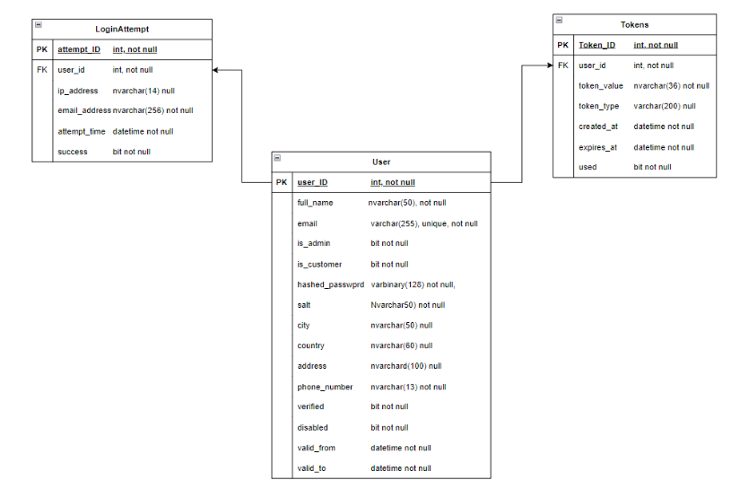

# SQL-authentication-system
A secure, role-based authentication system built with T-SQL for a fictional car dealership. Features include user registration, email verification, login tracking, password reset, role management, account lockout, and dynamic reporting using views and window functions.

# SQL User Authentication System – Hederlige Harrys Bilar

## 📌 Overview

This project is a secure, role-based user authentication system built entirely in **T-SQL** for a fictional car dealership, *Hederlige Harrys Bilar*. It includes functionality for user registration, email verification, password reset, login tracking, and role management.

---

## 🔐 Features

- User registration and email verification
- Password hashing (salted) and secure reset via time-limited tokens
- Role support: Admin and Customer
- Login lockout after repeated failed attempts
- Login tracking (IP, timestamp, success flag)
- Views for:
  - Last successful and failed logins per user
  - Login summary per IP with window functions
- Stored procedures for:
  - `TryLogin(email, password, ipaddress)`
  - `ForgotPassword(email)`
  - `SetForgottenPassword(email, password, token)`
- Indexed for performance and query optimization

---

## 🧩 Entity Relationship Diagram (ERD)

---

## 📄 Documentation

📎 [View full project documentation (PDF)](Documentation/Documentation.pdf)

---

## 🚀 How to Use

1. Open [`HarrysDatabase.sql`](Script/HarrysDatabase.sql) in SQL Server Management Studio or Azure Data Studio
2. Execute the full script to create the database, tables, views, and procedures
3. Use the test calls at the bottom of the script to verify functionality (e.g., `EXEC TryLogin`, etc.)

---

## 🧰 Tools & Concepts Used

- Microsoft SQL Server / T-SQL
- Stored Procedures
- Views with CTEs & Window Functions
- Password Hashing & Salt
- Security Tokens
- Database Indexing

